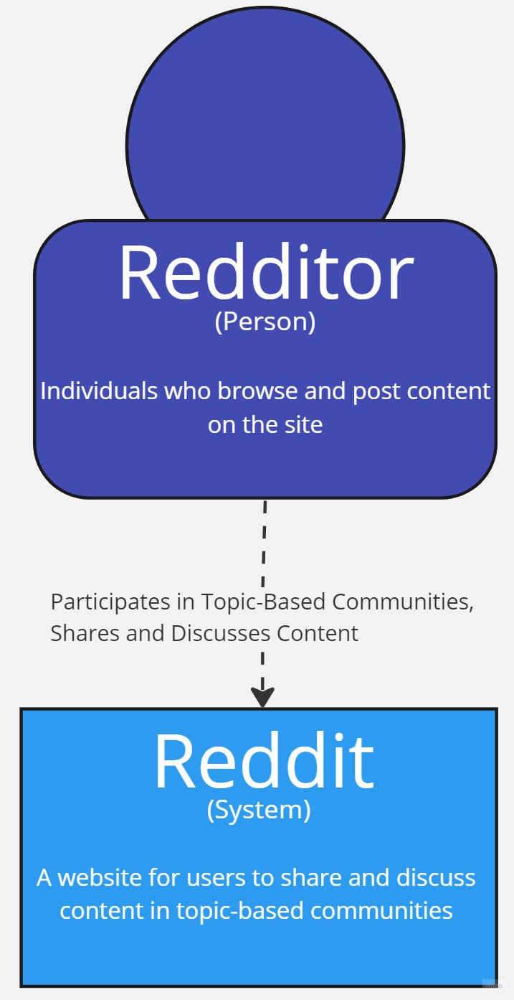
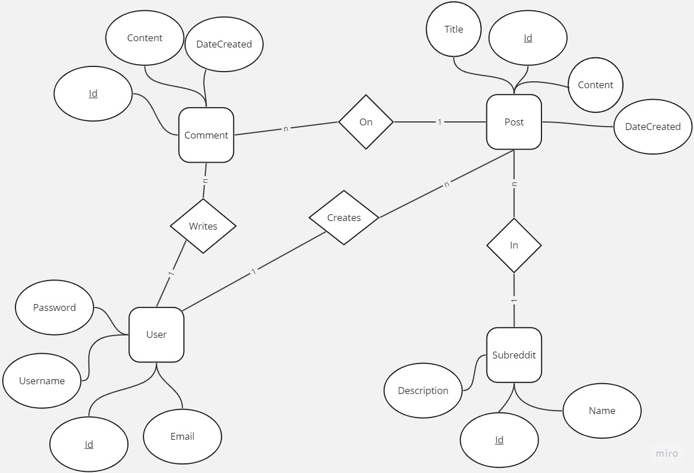

# Reading Guide

## Requirements Assignment

Toggle me!

Whether you are doing a small project on your own, or a large multidisciplinary project for a large company; everything depends on good requirements. Therefore, it is important to have an overview of what the application should do.

Therefore, in consultation with the client (as in the pro task) or on your own (as in your individual project), you will create a list of functionalities and prioritize them. 

N.B. Also look back at your one-slide idea and project description. If all goes well, you have described there what the goal of your project is. This is the good starting point for thinking and drafting your requirements.

Requirements often have 3 elements:
- Requirement: The behavior the system must exhibit.
- Constraints (on a requirement): Further tightening of the observable behavior of the system (think restrictions on input, things that are or are not allowed)
- Quality requirements (on a requirement): General requirements for the system, usually not a tightening of the behavior, but the way the behavior manifests itself (think sorting a view can be descending and ascending).

### Reddit - Requirements

Toggle me!

Look-Back at project description: In this project, I aim to create a replica of the popular social media platform Reddit. My platform will allow users to create an account and login securely, create new posts with text and/or media content, view a feed of posts from all users or from specific subreddits, upvote or downvote posts and comments, comment on posts and reply to other comments, edit or delete their own posts and comments, and connect to a relational database to store user data, posts, comments, and other relevant information.

We have gathered and documented requirements for My project using various methods, including interviews with stakeholders, studying documentation, reverse engineering, prototyping, and focus groups. We have prioritized My requirements using the MoSCoW method and have organized them according to the FR (Functional Requirement), B (Beperking), and K (Kwaliteitseis) categories.

My project will adhere to industry best practices for software development and will implement standard techniques and tools for software quality assurance. We will regularly test My software to identify and fix bugs and improve its overall quality. My goal is to deliver a reliable and user-friendly platform that meets the needs of My stakeholders.

FR = Functional Requirement
B = Beperking
K = Kwaliteitseis

- FR-01: The platform allows users to create an account and login securely. (Must have)
  - B-01.1: User authentication and authorization are implemented according to industry best practices to ensure the security of user data.
  - K-01.1: The platform must prevent unauthorized access to user data.
- FR-02: Users can create new posts with text and/or media content. (Must have)
  - B-02.1: The platform supports the creation and moderation of subreddits by users.
  - K-02.1: Posts must be displayed in a clear and organized manner.
- FR-03: Users can view a feed of posts from all users or from specific subreddits. (Must have)
  - B-03.1: The platform implements efficient algorithms to sort and filter posts based on user preferences and subreddit rules.
  - K-03.1: The platform must provide a responsive and user-friendly interface for browsing posts.
- FR-04: Users can upvote or downvote posts and comments. (Should have)
  - B-04.1: The platform implements a fair and transparent voting system that prevents abuse and ensures the integrity of user-generated content.
  - K-04.1: The voting system must be easy to use and understand.
- FR-05: Users can comment on posts and reply to other comments. (Should have)
  - B-05.1: The platform supports threaded discussions and allows users to easily navigate between different levels of comments.
  - K-05.1: Comments must be displayed in a clear and organized manner.
- FR-06: Users can edit or delete their own posts and comments. (Should have)
  - B-06.1: The platform implements appropriate access controls to ensure that users can only modify their own content.
  - K-06.1: The platform must provide a user-friendly interface for editing and deleting content.
- FR-07: The platform connects to a relational database to store user data, posts, comments, and other relevant information. (Must have)
  - B-07.1: The database is designed according to industry best practices to ensure data integrity and efficient querying.
  - K-07.1: The platform must provide fast and reliable access to data.
- FR-08: The platform implements standard techniques and tools for software quality assurance. (Could have)
  - B-08.1: The development team regularly tests the software to identify and fix bugs and improve its overall quality.
  - K-08.1: The software must be reliable and free of critical bugs.

  

## Use-cases Assignment

Toggle me!

The next step in developing the application is to create Use Cases based on the requirements. A Use Case describes "who" can do "what" with the system in question. Use Cases consist of a scenario description. The relationship between the Actors and their Use Cases can be represented in a Use Case diagram. Note that such a diagram is worthless without the descriptions.

  

### Reddit Use Cases

Toggle me!

Field | Description
--- | ---
Name | UC01: Create an account and login
Summary | - A user can create an account on the platform by providing their information and choosing a secure password. - The platform implements user authentication and authorization according to industry best practices to ensure the security of user data.
Actors | User
Assumptions | None
Scenario | - The actor navigates to the platform’s homepage and clicks on the “Sign Up” button. - The actor is redirected to a registration page where they are prompted to enter their personal information such as their name, email address, and date of birth. - The actor chooses a unique username and a secure password that meets the platform’s password requirements. - The actor clicks on the “Submit” button to create their account. - The actor receives a confirmation email with a link to verify their email address. - The actor clicks on the verification link to complete the registration process. - The actor can now login securely using their username and password.
Exceptions | - Not all required information has been entered. - The entered password does not meet the security requirements. - The chosen username is already taken.
Result | A new account has been created and the user can login securely.

Field | Description
--- | ---
Name | UC02: Create a new post
Summary | - A user can create a new post with text and/or media content. - The platform supports the creation and moderation of subreddits by users.
Actors | User
Assumptions | The user is logged in and has permission to create posts.
Scenario | - The actor logs into their account and navigates to the subreddit where they want to create a post. - The actor clicks on the “Create Post” button located at the top of the subreddit page. - The actor is redirected to a post creation page where they can enter the post title and content (text and/or media). - The actor can format their post using the platform’s text editor and add media such as images or videos by uploading files or providing URLs. - The actor can preview their post before publishing it by clicking on the “Preview” button. - Once satisfied with their post, the actor clicks on the “Submit” button to publish it.
Exceptions | - The entered post title or content is invalid or does not meet subreddit rules. - The user does not have permission to create posts in the selected subreddit.
Result | A new post has been created and is visible to other users.

Field | Description
--- | ---
Name | UC03: View a feed of posts
Summary | - A user can view a feed of posts from all users or from specific subreddits. - The platform implements efficient algorithms to sort and filter posts based on user preferences and subreddit rules.
Actors | User
Assumptions | None
Scenario | - The actor navigates to the platform’s homepage or a specific subreddit page. - By default, the actor sees a feed of posts sorted by “Hot”, which displays popular posts from all users or from the selected subreddit. - The actor can change how posts are sorted by clicking on one of several sorting options such as “New”, “Top”, or “Controversial”. - The actor can also filter posts by time range (e.g., past hour, past 24 hours, past week) using a drop-down menu. - The actor can interact with posts by clicking on them to view their content, upvoting or downvoting them, commenting on them, or sharing them with others. - The actor can also save posts for later viewing by clicking on the “Save” button located below each post. - The actor can navigate between pages of posts using pagination controls located at the bottom of the feed. - The actor can also search for specific posts using keywords or phrases by entering them into a search bar located at the top of the page. - The search results are displayed in a separate feed that can be sorted and filtered using the same controls as described above. - The actor can return to their original feed at any time by clearing their search query or navigating back to the homepage or subreddit page.
Exceptions | None
Result | The user can view a feed of posts from all users or from specific subreddits.

  

## Context Diagram

Toggle me!

A software application always runs in a certain context: A number of external systems and actors with which the application interacts. These include users, external APIs and other hardware or software. 

To give a first idea of what the software might look like, you can make a context diagram for this purpose. Here you consider your application as a black-box and start looking at what other things the application interacts with. 

If you have this context, then such a diagram can be used as input for requirements or user stories, and gives, for example, an overview of the actors of the system. In design, a context diagram can also be used as a basis for the software architecture.

Additional information
The C4 model provides an explanation of the Context diagramLinks to an external site.

  

### Reddit Context Diagram

Toggle me!

  

## Conceptual Model

Toggle me!

In addition to an outline of the context, it also makes sense to create conceptual models early in the project to provide structure to the application domain. It serves as a talking picture with the customer and does not contain technical details, but uses "the language of the customer. Therefore, in it you do not yet make technical decisions such as "what type does each attribute have", "how do I then store this in the database" and "what behavior of the system comes in which entity".

Therefore, the conceptual model contains only entities, relationships and the most important attributes for the applicaite.

In the SQL dictation (Chapter 2) Download SQL dictation (Chapter 2)there is information about setting up a conceptual model.
Once you have set up a Context diagram and a Conceptual model, you have a nice analysis of the outside world and the customer domain and can get to work translating these requirements into a technical solution.

  

### Reddit Conceptual Model

Toggle me!

  
